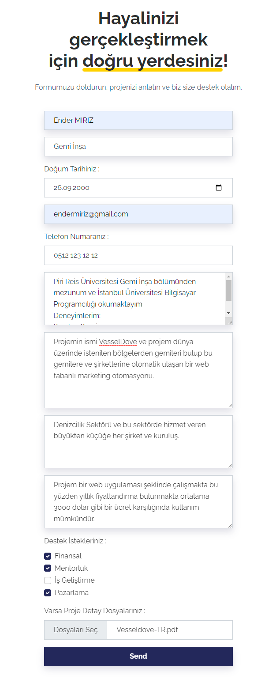
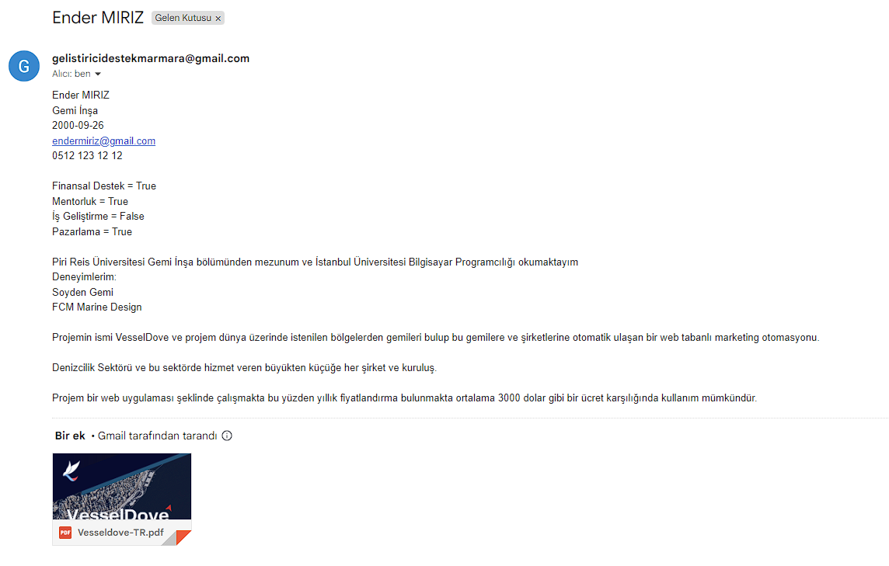

    
# About

This repository provides a web-based platform where student entrepreneurs can fill out a form to present their projects and themselves, and submit requests for support. The organization receives and reviews these applications, offering assistance in areas such as business development, finance, mentorship, and marketing to the student entrepreneurs. The platform aims to help student entrepreneurs successfully bring their projects to life.

This repo contains the codebase of the platform and is open for developers who want to contribute by fixing bugs, adding new features, or making improvements. It also welcomes user feedback to facilitate discussions and collaboration for the ongoing development and enhancement of the project.

This repository invites anyone interested in contributing to the support of student entrepreneurs and aims to facilitate the continuous growth and improvement of the platform.

## Website & Screenshots
### Website
[Gelistiricidestekmarmara.miriz.me](https://gelistiricidestekmarmara.miriz.me/)

### Screenshots

{:height="50%" width="50%"}

{:height="50%" width="50%"}
